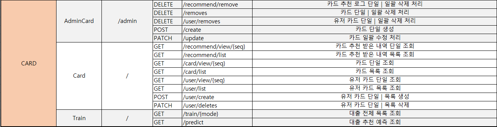
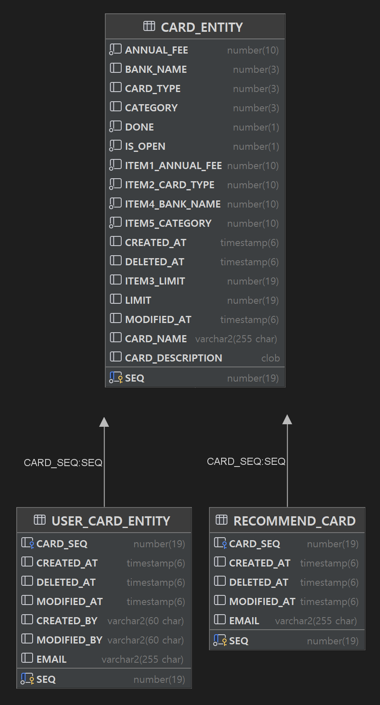

  

# AnonymousCIS 프로젝트

# 기능 명세서

## 🔹 도메인 URL 설계 🔹

## 🔹 관리자 페이지 🔹
- 추천 카드 단일 & 목록 삭제
- 카드 단일 생성
- 카드 단일 & 목록 일괄 수정
- 카드 단일 & 목록 일괄 삭제
- 유저 카드 단일 & 목록 일괄 삭제

## 🔹 사용자(회원) 페이지 🔹
- 추천 카드 단일 조회
- 추천 카드 목록 조회
- 카드 단일 조회
- 카드 목록 조회
- 유저 카드 단일 & 목록 생성
- 유저 카드 단일 조회
- 유저 카드 목록 조회
- 유저 카드 단일 & 목록 삭제

## 🔹 Swagger API 🔹
- 링크 : https://cis-card-service.jinilog.com/apidocs.html

내일 배포후 이미지 추가 예정

[//]: # (  )

# ERD (Entity 관계도)

# CARD_Entity
| 키  | 논리        | 물리               | 도메인           | 타입        | Length | UNIQUE | NULL허용 | 기본값 |
|:--:|-----------|------------------|---------------|-----------|--------|----|--|---|
| pk | 카드 등록 번호  | SEQ              | Long          | NUMBER    | 19     | Y  | N 
|    | 카드 이름     | CARD_NAME        | String        | VARCHAR2  | 255    |    | N |   |       |
|    | 카드 타입     | CARD_TYPE        | CardType      | NUMBER    | 3      |    | N |   |  |
|    | 은행명       | BANK_NAME        | BankName      | NUMBER    | 3      |    | N |   |       |
|    | 카테고리      | CATEGORY         | Category      | NUMBER    | 33     |    | N |   |       |
|    | 카드 한도     | LIMIT            | Long          | NUMBER    | 19     |    | N |
|    | 연회비       | ANNUAL_FEE       | int           | NUMBER    | 10     |    | N |   |       |
|    | 카드 설명     | CARD_DESCRIPTION | String        | CLOB      |        |    | N |   |       |
|    | 학습 완료 여부  | DONE             | boolean           | NUMBER    | 1, 0   |    | N |   |       |
|    | 공개 여부     | IS_OPEN          | boolean       | NUMBER    | 1,0    |    | N |  
|    | 특성1 연회비   | ITEM1_ANNUAL_FEE | int           | NUMBER    | 10     |    | N |   |       |
|    | 특성2 카드 타입 | ITEM2_CARD_TYPE  | int           | NUMBER    | 10     |    | N |   |       |
|    | 특성3 카드 한도 | ITEM3_LIMIT      | Long          | NUMBER    | 19     |    | N |   |       |
|    | 특성4 은행명   | ITEM4_BANK_NAME  | int           | NUMBER    | 10     |    | N |  
|    | 특성5 카테고리  | ITEM5_CATEGORY   | int           | NUMBER    | 10     |    | N |
|    | 생성일시      | CREATED_AT       | LocalDateTime | TIMESTAMP      | 6      |    |  | 
|    | 수정일시      | MODIFIED_AT      | LocalDateTime | TIMESTAMP      | 6      |    |  | 
|    | 삭제일시      | DELETED_AT       | LocalDateTime | TIMESTAMP | 6      |    |  |  

# USER_CARD_Entity
| 키  | 논리          | 물리          | 도메인           | 타입        | Length | UNIQUE | NULL허용 | 기본값 |
|:--:|-------------|-------------|---------------|-----------|--------|----|--------|---|
| pk | 유저 카드 등록 번호 | SEQ         | Long          | NUMBER    | 19     | Y  | N      
|    | 이메일         | EMAIL       | String        | VARCHAR2  | 255    |    | N      |   |       |
|    | 생성일시        | CREATED_AT  | LocalDateTime | TIMESTAMP      |        |    |        | 
|    | 수정일시        | MODIFIED_AT | LocalDateTime | TIMESTAMP      |        |    |        | 
|    | 삭제일시        | DELETED_AT  | LocalDateTime | TIMESTAMP |        |    |        |  
|    | 생성자         | CREATED_BY  | LocalDateTime | TIMESTAMP |        |    |        |
|    | 수정자         | MODIFIED_BY | LocalDateTime | TIMESTAMP |        |    |        |

# RECOMMEND_CARD_Entity
| 키  | 논리          | 물리          | 도메인           | 타입        | Length | UNIQUE | NULL허용 | 기본값 |
|:--:|-------------|-------------|---------------|-----------|--------|----|--------|---|
| pk | 추천 카드 등록 번호 | SEQ         | Long          | NUMBER    | 19     | Y  | N      
|    | 이메일         | EMAIL       | String        | VARCHAR2  | 255    |    | N      |   |       |
|    | 생성일시        | CREATED_AT  | LocalDateTime | TIMESTAMP      |        |    |        |
|    | 수정일시        | MODIFIED_AT | LocalDateTime | TIMESTAMP      |        |    |        |
|    | 삭제일시        | DELETED_AT  | LocalDateTime | TIMESTAMP |        |    |        |